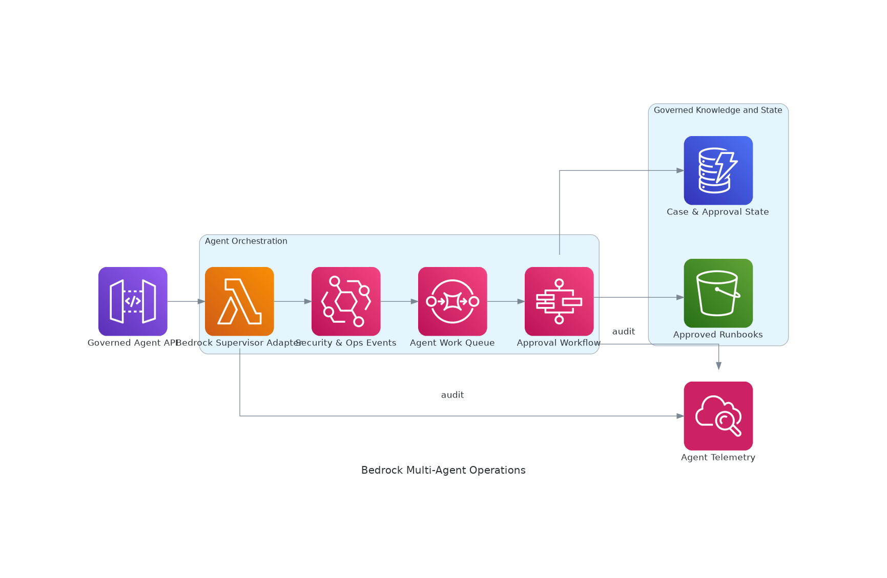
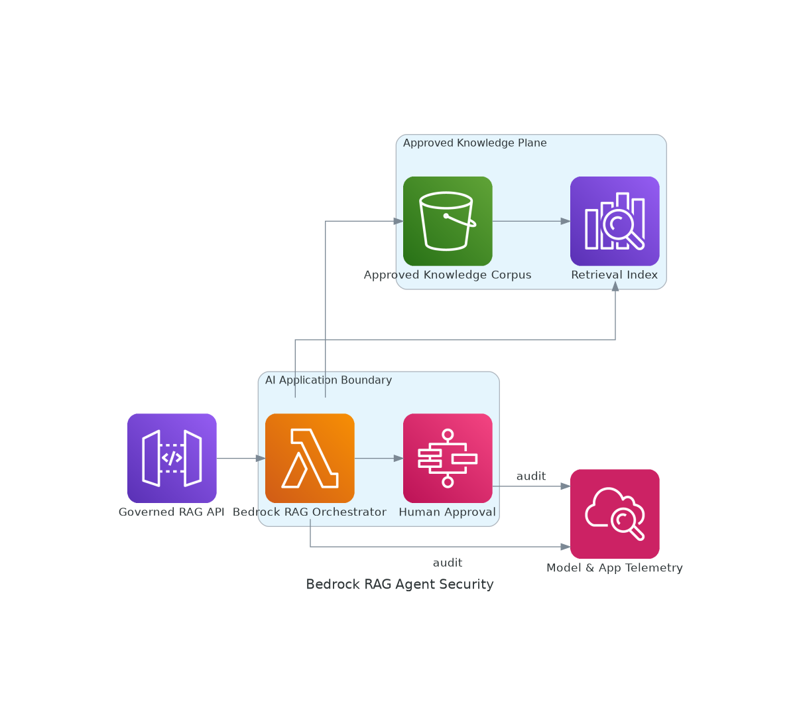
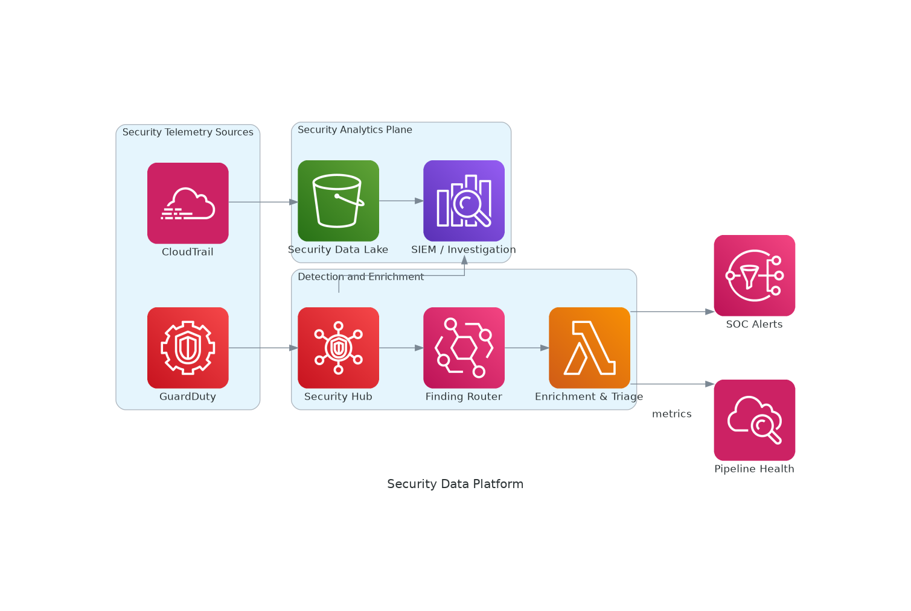
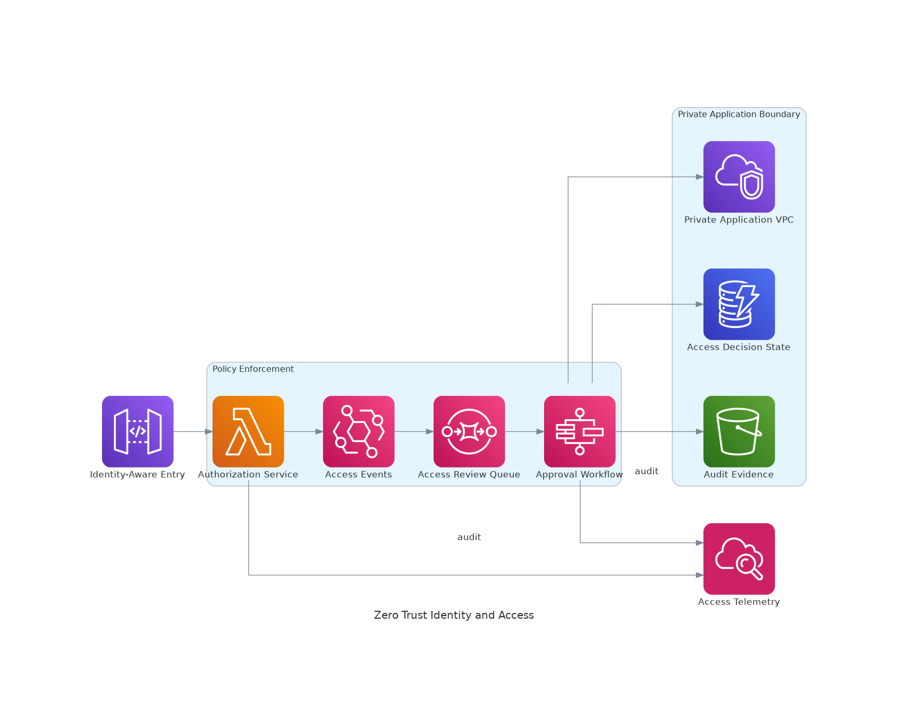
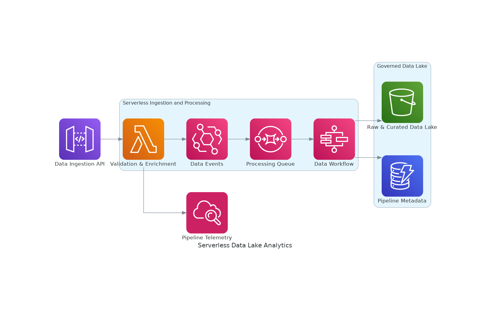
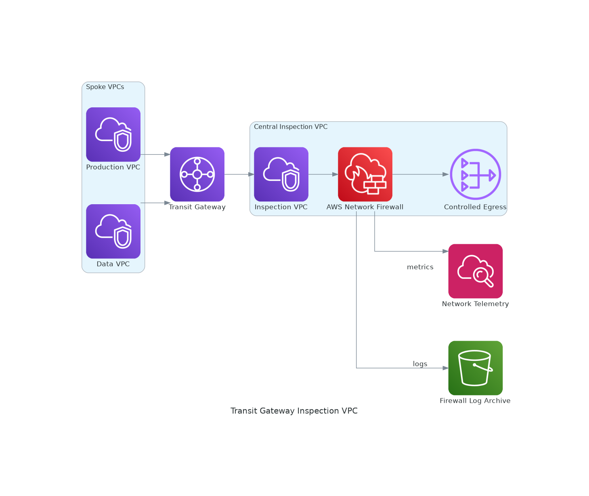

# AWS Architecture Diagram Gallery

These diagrams are generated as architecture-as-code with the Python `diagrams` library and Graphviz, using AWS service icons and professional grouped architecture boundaries.

> PNG previews are the primary presentation format. Python source files under `aws-diagrams/` are the editable architecture-as-code definitions.

## Bedrock Multi Agent Operations

[Editable Python diagram source](aws-diagrams/bedrock-multi-agent-operations.py)

## Bedrock Rag Agent Security

[Editable Python diagram source](aws-diagrams/bedrock-rag-agent-security.py)

## Security Data Platform

[Editable Python diagram source](aws-diagrams/security-data-platform.py)

## Security Zero Trust Identity

[Editable Python diagram source](aws-diagrams/security-zero-trust-identity.py)

## Serverless Data Lake Analytics

[Editable Python diagram source](aws-diagrams/serverless-data-lake-analytics.py)

## Transit Gateway Inspection Vpc

[Editable Python diagram source](aws-diagrams/transit-gateway-inspection-vpc.py)
